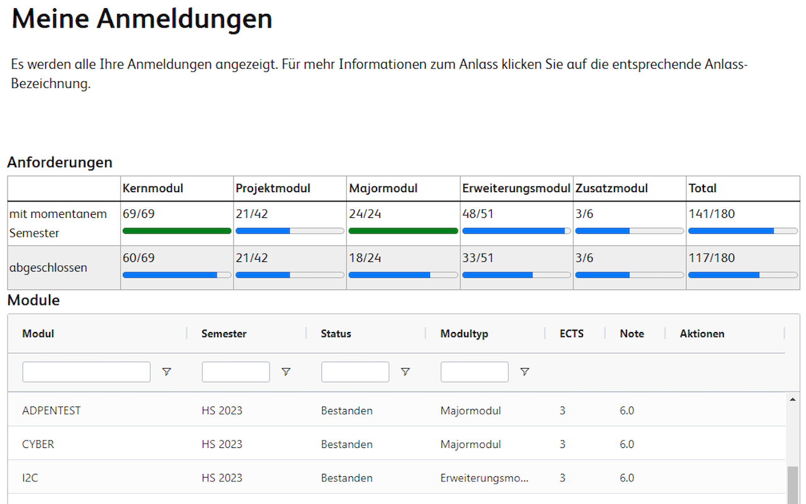
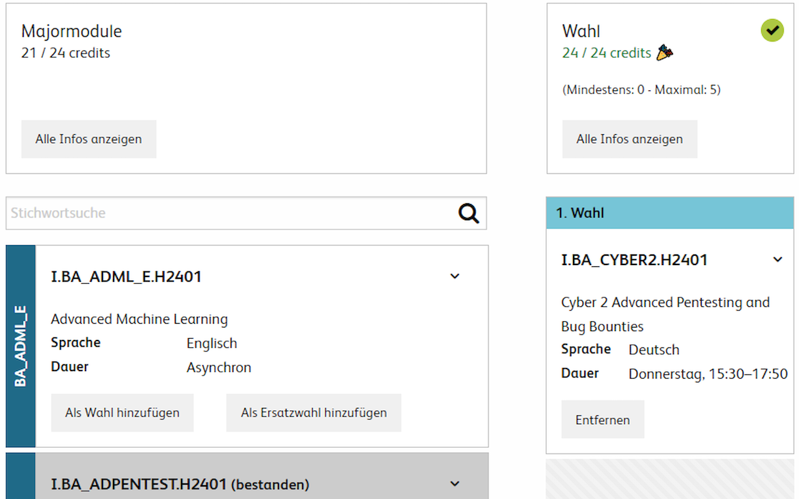

# HSLU Web Helper

Adds extra UI to the Hochschule Luzern website(s).

The module listing page now shows the requirements for your bachelors degree and how many credits you have already achieved. When registering for modules, the current amount of credits for that type is shown right on the page, so you know if you still need to take any modules of that type.

### Installation

[Install on Firefox](https://github.com/Alainx277/hslu-web-helper/releases/download/0.1.1/hslu_web_helper-0.1.1.xpi)

[Install on Chrome](https://chromewebstore.google.com/detail/hslu-web-helper/jmmmhflieajgaepocgkhdemnaakmedki)

### Screenshots




### Development

Install dependencies

```shell
npm install
```

Build extension

```shell
npm run build
```

Load the unpacked extension in [Chrome](https://knowledge.workspace.google.com/kb/load-unpacked-extensions-000005962) or [Firefox](https://extensionworkshop.com/documentation/develop/temporary-installation-in-firefox/) (note: Firefox extension must be built with env `BROWSER=firefox`)

Before creating a pull request, lint and format your changes.

```shell
npm run lint
npm run format
```

### Module data

Data about modules is stored inside of the extension using the `src/modules.json` file. It needs to be updated once per semester using the `modules.py` script. The only argument is the first available semester (should always be F21):

```shell
python .\modules.py F21
```

This process uses the API for the HSLU Module Master maintained by other students. We cache the data here because the API might stop existing.

In case the API ever stops being updated there's the original `module-extractor` Rust program which reads the data from the actual PDFs on MyCampus.
Unfortunately the newer PDFs use a matrix which can't be parsed using text, as it originally was implemented. I'd rely on a multimodal LLM or other neural network OCR solution to parse the matrix from the PDF.

### Firefox Release Build

This section is required for Mozilla to review the addon.

Software:

- Windows 10
- node v20.11.0
- npm 10.2.4
- powershell

Build instructions:

```
npm install
$env:BROWSER='firefox'
$env:NODE_ENV='production'
npm run build
```
